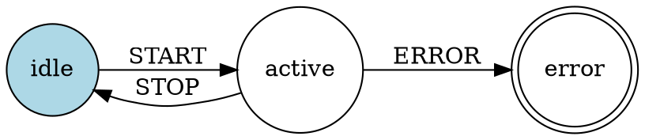

# Architecture: Golang Statechart Engine

**Generated via MAKER cycle** (10 agents, majority voting, validation score: 0.95)

## Overview

This document describes the detailed design of the 13 core components identified through consensus. The architecture supports hierarchical states, parallel regions, history states, guards, actions, and pluggable extensibility with stdlib-only core.

## Core Components (13)

### Tier 1: Primitives (Foundation)

#### 1. Event

**Structure**
```go
type Event struct {
    Type string
    Data any
}
```

**Responsibilities**
- Immutable typed events with arbitrary payload for triggering transitions
- FIFO queuing support
- Deferred event handling
- Internal event generation
- Zero-allocation friendly for <1μs latency target

**Dependencies**: None

---

#### 2. Context

**Structure**
```go
type Context struct {
    mu   sync.RWMutex
    data map[string]any
}
```

**Responsibilities**
- Thread-safe shared mutable data store
- Accessible by guards, actions, state logic
- Per-machine instance isolation
- Serialized with machine snapshots for persistence

**API**
```go
func (c *Context) Get(key string) (any, bool)
func (c *Context) Set(key string, val any)
func (c *Context) Delete(key string)
```

**Dependencies**: None

---

#### 3. StateConfig

**Structure**
```go
type StateType string

const (
    Atomic        StateType = "atomic"
    Compound      StateType = "compound"
    Parallel      StateType = "parallel"
    ShallowHistory StateType = "shallowHistory"
    DeepHistory   StateType = "deepHistory"
)

type StateConfig struct {
    ID       string
    Type     StateType
    Initial  string                      // for compound/parallel
    On       map[string][]TransitionConfig
    Entry    []ActionRef
    Exit     []ActionRef
    Children []*StateConfig
}
```

**Responsibilities**
- Hierarchical declarative blueprint for state tree
- Supports nesting (compound states)
- Supports orthogonal regions (parallel states)
- Supports history restoration (shallow/deep)
- Defines entry/exit actions per state
- Maps events to transitions

**Dependencies**: Event, Context (via ActionRef types)

---

#### 4. TransitionConfig

**Structure**
```go
type TransitionConfig struct {
    Event   string
    Guard   GuardRef
    Target  string      // state path (e.g., "parent.child")
    Actions []ActionRef
    Priority int        // higher = evaluated first
}

type ActionRef interface{}  // string ID or func(Context, Event)
type GuardRef interface{}   // string ID or func(Context, Event) bool
```

**Responsibilities**
- Event-driven state change specification
- Conditional guards for transition eligibility
- Side-effect actions on transition
- Priority-based conflict resolution (innermost/highest priority first)

**Dependencies**: Event, Context

---

### Tier 2: Runtime Core

#### 5. Machine

**Structure**
```go
type MachineConfig struct {
    ID      string
    Initial string
    States  map[string]*StateConfig
}

type Machine struct {
    config     MachineConfig
    current    []string          // active state paths
    ctx        *Context
    mu         sync.RWMutex
    eventQueue chan Event
    done       chan struct{}

    // Pluggable components (injected via Options)
    actionRunner  ActionRunner
    guardEval     GuardEvaluator
    eventSource   EventSource
    persister     Persister
    publisher     EventPublisher
    visualizer    Visualizer
}
```

**Responsibilities**
- Root orchestrator managing active configuration
- Event queue management (FIFO, backpressure)
- Extensibility hook coordination
- Goroutine-safe state access via mutex

**API**
```go
func NewMachine(config MachineConfig, opts ...Option) *Machine
func (m *Machine) Start() error
func (m *Machine) Send(event Event) error
func (m *Machine) Current() []string
func (m *Machine) Stop() error
```

**Options Pattern**
```go
type Option func(*Machine)

func WithActionRunner(r ActionRunner) Option
func WithGuardEvaluator(e GuardEvaluator) Option
func WithEventSource(s EventSource) Option
func WithPersister(p Persister) Option
func WithPublisher(pb EventPublisher) Option
func WithVisualizer(v Visualizer) Option
```

**Dependencies**: StateConfig, TransitionConfig, Event, Context, Interpreter

---

#### 6. Interpreter

**Responsibilities**
- Core event loop processor (channel-based, single-threaded per Machine instance)
- <1μs latency target, stdlib-only, lock-free where possible
- Deterministic transition selection and execution

**Algorithm**
```
loop:
  1. Dequeue event from Machine.eventQueue
  2. Match transitions from active StateConfig.On (hierarchical, priority-ordered)
  3. Evaluate guards via GuardEvaluator
  4. Select highest-priority valid transition
  5. Compute LCCA (Least Common Compound Ancestor)
  6. Execute exit actions (from innermost to LCCA)
  7. Execute transition actions
  8. Execute entry actions (from LCCA to target)
  9. Update Machine.current to new state paths
  10. Invoke hooks (Persister, EventPublisher)
  11. Handle history restoration if target is history state
  12. Handle parallel region synchronization if needed
```

**Implementation Sketch**
```go
func (m *Machine) interpret() {
    for {
        select {
        case event := <-m.eventQueue:
            m.processEvent(event)
        case <-m.done:
            return
        }
    }
}

func (m *Machine) processEvent(event Event) {
    // Transition matching, guard eval, action execution, state update
}
```

**Handles**
- Initial/final states
- History restoration (via HistoryManager)
- Parallel region synchronization (sync.WaitGroup)
- Deferred events (re-enqueue after processing)

**Dependencies**: Machine, StateConfig, TransitionConfig, ActionRunner, GuardEvaluator, HistoryManager

---

#### 7. HistoryManager

**Structure**
```go
type HistoryManager struct {
    // Map of history state ID -> last active child state path
    shallowHistory map[string]string
    deepHistory    map[string][]string
}
```

**Responsibilities**
- Track last active state on exit from compound states
- Restore shallow history (last direct child only)
- Restore deep history (full subtree configuration)
- Prune snapshots for memory efficiency

**API**
```go
func (h *HistoryManager) RecordExit(historyStateID string, activeChild string, isDeep bool)
func (h *HistoryManager) Restore(historyStateID string) ([]string, bool)
```

**Usage in Interpreter**
```go
// On exit from compound state with history child:
if hasHistoryChild(state) {
    historyMgr.RecordExit(historyID, currentChild, isDeep)
}

// On transition to history state:
if target.Type == ShallowHistory || target.Type == DeepHistory {
    restored, ok := historyMgr.Restore(target.ID)
    if ok {
        current = restored
    } else {
        current = target.Initial // fallback
    }
}
```

**Dependencies**: StateConfig

---

### Tier 3: Extensibility Interfaces (Pluggable via Options)

#### 8. ActionRunner

**Interface**
```go
type ActionRunner interface {
    Run(ctx *Context, action ActionRef, event Event) error
}
```

**Responsibilities**
- Pluggable executor for entry/exit/transition side-effects
- Default: Direct function invocation for `func(Context, Event)` types
- Custom: Script execution, external API calls, logging

**Default Implementation**
```go
type DefaultActionRunner struct{}

func (r *DefaultActionRunner) Run(ctx *Context, action ActionRef, event Event) error {
    switch a := action.(type) {
    case func(*Context, Event):
        a(ctx, event)
        return nil
    case string:
        return fmt.Errorf("action ID '%s' not registered", a)
    default:
        return fmt.Errorf("unknown action type: %T", action)
    }
}
```

**Use Cases**
- Logging: Log state transitions
- Database: Persist side-effects to DB
- External APIs: Trigger webhooks, notifications

**Dependencies**: Context, Event

---

#### 9. GuardEvaluator

**Interface**
```go
type GuardEvaluator interface {
    Eval(ctx *Context, guard GuardRef, event Event) bool
}
```

**Responsibilities**
- Pluggable predicate evaluator for conditional transitions
- Default: Function-based boolean check
- Custom: Expression languages (e.g., CEL), rule engines

**Default Implementation**
```go
type DefaultGuardEvaluator struct{}

func (e *DefaultGuardEvaluator) Eval(ctx *Context, guard GuardRef, event Event) bool {
    if guard == nil {
        return true // no guard = always pass
    }

    switch g := guard.(type) {
    case func(*Context, Event) bool:
        return g(ctx, event)
    case string:
        // Could integrate with expression evaluator here
        return false
    default:
        return false
    }
}
```

**Use Cases**
- Complex conditions: `ctx.Get("balance") > 1000 && event.Data.amount < 500`
- Expression languages: CEL, Expr, Gval
- Rule engines: Business logic decision tables

**Dependencies**: Context, Event

---

#### 10. EventSource

**Interface**
```go
type EventSource interface {
    Events() <-chan Event
}
```

**Responsibilities**
- Pluggable external event stream ingestion
- Integrated with Machine via goroutine that feeds `Machine.Send()`

**Example Implementations**
```go
// Channel-based
type ChannelEventSource struct {
    ch chan Event
}

func (s *ChannelEventSource) Events() <-chan Event {
    return s.ch
}

// File watcher
type FileWatcherEventSource struct {
    watcher *fsnotify.Watcher
    events  chan Event
}

func (s *FileWatcherEventSource) Events() <-chan Event {
    go func() {
        for event := range s.watcher.Events {
            s.events <- Event{Type: "file.changed", Data: event}
        }
    }()
    return s.events
}
```

**Integration**
```go
func (m *Machine) Start() error {
    if m.eventSource != nil {
        go func() {
            for event := range m.eventSource.Events() {
                m.Send(event)
            }
        }()
    }
    go m.interpret()
    return nil
}
```

**Dependencies**: Event

---

### Tier 4: Production Integrations

#### 11. Persister

**Interface**
```go
type MachineSnapshot struct {
    MachineID    string
    Config       MachineConfig
    Current      []string
    Context      map[string]any
    QueuedEvents []Event
    Timestamp    time.Time
}

type Persister interface {
    Save(ctx context.Context, snapshot MachineSnapshot) error
    Load(ctx context.Context, machineID string) (MachineSnapshot, error)
}
```

**Responsibilities**
- Snapshot machine state for durability
- Restore machine from snapshot (crash recovery, migration)
- Adapters for various backends

**Snapshot Contents**
- Machine configuration (immutable blueprint)
- Current active state paths
- Context data
- Queued events (for exactly-once processing)
- Timestamp

**Adapters**
```go
// JSON (stdlib)
type JSONPersister struct {
    dir string
}

// BoltDB
type BoltPersister struct {
    db *bolt.DB
}

// PostgreSQL
type PostgresPersister struct {
    db *sql.DB
}

// Redis
type RedisPersister struct {
    client *redis.Client
}
```

**Hook in Interpreter**
```go
func (m *Machine) processEvent(event Event) {
    // ... transition logic ...

    if m.persister != nil {
        snapshot := m.createSnapshot()
        if err := m.persister.Save(context.Background(), snapshot); err != nil {
            // Handle error (retry, log, etc.)
        }
    }
}
```

**Dependencies**: MachineConfig, Context, Event

---

#### 12. EventPublisher

**Interface**
```go
type MachineMetadata struct {
    MachineID   string
    Transition  string  // "stateA -> stateB"
    Timestamp   time.Time
}

type EventPublisher interface {
    Publish(ctx context.Context, event Event, metadata MachineMetadata) error
    Close() error
}
```

**Responsibilities**
- Stream processed events to external systems
- Enable observability, audit logging, event sourcing
- Exactly-once semantics via coordination with Persister

**Adapters**
```go
// Kafka
type KafkaPublisher struct {
    producer sarama.AsyncProducer
    topic    string
}

// NATS
type NATSPublisher struct {
    conn *nats.Conn
    subject string
}

// RabbitMQ
type RabbitMQPublisher struct {
    ch    *amqp.Channel
    queue string
}
```

**Exactly-Once Pattern**
```go
func (m *Machine) processEvent(event Event) {
    // 1. Execute transition
    // 2. Persist snapshot (with idempotency key)
    if m.persister != nil {
        snapshot := m.createSnapshot()
        snapshot.IdempotencyKey = event.ID
        m.persister.Save(ctx, snapshot)
    }

    // 3. Publish (deduplicated downstream via idempotency key)
    if m.publisher != nil {
        metadata := MachineMetadata{
            MachineID: m.config.ID,
            Transition: fmt.Sprintf("%v -> %v", oldState, newState),
        }
        m.publisher.Publish(ctx, event, metadata)
    }
}
```

**Dependencies**: Event

---

#### 13. Visualizer

**Interface**
```go
type Visualizer interface {
    ExportDOT(config MachineConfig, current []string) string
    RenderSVG(dot string) ([]byte, error)
    ExportJSON(config MachineConfig) ([]byte, error)
}
```

**Responsibilities**
- Generate Graphviz DOT for statechart visualization
- Highlight current active states
- Export JSON schema for web UIs
- Debugging and documentation

**DOT Output Example**


**Implementation Sketch**
```go
type DefaultVisualizer struct{}

func (v *DefaultVisualizer) ExportDOT(config MachineConfig, current []string) string {
    var buf strings.Builder
    buf.WriteString("digraph statechart {\n")

    // Traverse StateConfig tree
    for _, state := range config.States {
        style := "solid"
        if contains(current, state.ID) {
            style = "filled,fillcolor=lightblue"
        }
        buf.WriteString(fmt.Sprintf("  %s [style=%s];\n", state.ID, style))

        // Transitions
        for event, transitions := range state.On {
            for _, trans := range transitions {
                buf.WriteString(fmt.Sprintf("  %s -> %s [label=\"%s\"];\n",
                    state.ID, trans.Target, event))
            }
        }
    }

    buf.WriteString("}\n")
    return buf.String()
}
```

**Dependencies**: MachineConfig

---

## Component Relationships

```
EventSource ──┐
              ├──> Machine.Send(Event)
User Code ────┘          │
                         ▼
                  [Event Queue (chan)]
                         │
                         ▼
                  Interpreter.processEvent()
                         │
                    ┌────┴────┐
                    ▼         ▼
        [Match Transitions] [Check History]
                    │         │
                    ▼         ▼
        GuardEvaluator.Eval() HistoryManager.Restore()
                    │
                    ▼
          [Select Target State]
                    │
        ┌───────────┼───────────┐
        ▼           ▼           ▼
    [Exit]    [Transition]  [Entry]
   Actions      Actions      Actions
        │           │           │
        └───────────┼───────────┘
                    ▼
          ActionRunner.Run()
                    ▼
       [Update Machine.current]
                    ▼
        ┌───────────┴───────────┐
        ▼                       ▼
  Persister.Save()    EventPublisher.Publish()
```

## Data Flow

1. **Event Ingestion**
   - `EventSource` pushes events OR user calls `Machine.Send()`
   - Events enqueued to `chan Event` (FIFO, buffered)

2. **Transition Matching**
   - `Interpreter` dequeues event
   - Matches against active `StateConfig.On` transitions
   - Priority ordering: innermost state first, then ancestors

3. **Guard Evaluation**
   - `GuardEvaluator` checks predicates on matched transitions
   - Selects first valid transition (highest priority with passing guard)

4. **State Update (LCCA Algorithm)**
   - Compute Least Common Compound Ancestor of source and target
   - Exit sequence: current → LCCA (innermost to outermost)
   - Entry sequence: LCCA → target (outermost to innermost)

5. **Action Execution**
   - `ActionRunner` invokes exit actions
   - `ActionRunner` invokes transition actions
   - `ActionRunner` invokes entry actions
   - All actions receive `Context` and `Event`

6. **Configuration Update**
   - Update `Machine.current` to new active state paths
   - Handle compound states: include all ancestor paths
   - Handle parallel states: maintain multiple active paths

7. **Post-Transition Hooks**
   - `Persister.Save()` - snapshot machine state
   - `EventPublisher.Publish()` - stream event to external systems
   - `Visualizer` can be queried for current state diagram

8. **History Handling**
   - If exiting compound state with history child: `HistoryManager.RecordExit()`
   - If entering history state: `HistoryManager.Restore()`
   - Shallow: restore direct child only
   - Deep: restore full subtree

## Concurrency Model

### Per-Machine Goroutine
- Single event loop goroutine per `Machine` instance
- Deterministic, single-threaded processing
- Ensures sequential consistency for transitions

### Mutex Protection
- `sync.RWMutex` on `Machine` struct
- Protects `current`, `config` during state updates
- Read locks for `Current()` queries during transitions
- Write locks for state updates in `processEvent()`

### Channel Queuing
- `chan Event` for event queue
- Buffered channel for backpressure handling
- Blocks `Send()` if queue full (configurable buffer size)
- FIFO ordering guaranteed

### Parallel Regions
- Compound states with `Type: Parallel`
- Spawn child `Machine` instances (or sub-interpreters)
- Each region processes events independently
- Synchronization on compound events:
  ```go
  type ParallelRegion struct {
      machines []*Machine
      wg       sync.WaitGroup
  }

  func (pr *ParallelRegion) Send(event Event) {
      for _, m := range pr.machines {
          pr.wg.Add(1)
          go func(machine *Machine) {
              defer pr.wg.Done()
              machine.Send(event)
          }(m)
      }
      pr.wg.Wait() // sync point
  }
  ```

### Lock-Free Paths
- `Context` accessed via atomic operations where possible
- Immutable `Event` structs (no locks needed)
- Copy-on-write for `current` state paths (minimize lock duration)

## Extension Points (Options Pattern)

All extensibility interfaces injected via functional options:

```go
type Option func(*Machine)

func WithActionRunner(r ActionRunner) Option {
    return func(m *Machine) {
        m.actionRunner = r
    }
}

func WithGuardEvaluator(e GuardEvaluator) Option {
    return func(m *Machine) {
        m.guardEval = e
    }
}

func WithEventSource(s EventSource) Option {
    return func(m *Machine) {
        m.eventSource = s
    }
}

func WithPersister(p Persister) Option {
    return func(m *Machine) {
        m.persister = p
    }
}

func WithPublisher(pb EventPublisher) Option {
    return func(m *Machine) {
        m.publisher = pb
    }
}

func WithVisualizer(v Visualizer) Option {
    return func(m *Machine) {
        m.visualizer = v
    }
}
```

**Usage**
```go
m := NewMachine(config,
    WithPersister(&BoltPersister{db: boltDB}),
    WithPublisher(&KafkaPublisher{topic: "events"}),
    WithActionRunner(&LoggingActionRunner{}),
)
```

## Dependency Graph (Build Order)

Implementation order based on dependencies:

```
1. Event, Context
   │
   ├─> 2. StateConfig, TransitionConfig
   │       │
   │       ├─> 3. MachineConfig
   │       │       │
   │       │       └─> 4. Machine
   │       │               │
   │       │               ├─> 5. Interpreter
   │       │               │       │
   │       │               │       └─> 6. HistoryManager
   │       │               │
   │       │               └─> 7-10. Extensibility Interfaces
   │       │                       │
   │       │                       ├─> ActionRunner
   │       │                       ├─> GuardEvaluator
   │       │                       └─> EventSource
   │       │
   │       └─> 11-13. Integration Interfaces
   │               │
   │               ├─> Persister
   │               ├─> EventPublisher
   │               └─> Visualizer
   │
   └─> (All components may use Event, Context)
```

### Build Phases

**Phase 1: Core Types** (Tier 1)
- `Event` struct
- `Context` struct with thread-safety
- `StateConfig` struct
- `TransitionConfig` struct
- `MachineConfig` struct

**Phase 2: Runtime** (Tier 2)
- `Machine` struct with basic `NewMachine()`, `Send()`, `Current()`
- `Interpreter` event loop with basic transition logic
- `HistoryManager` for shallow/deep history

**Phase 3: Extensibility** (Tier 3)
- `ActionRunner` interface + default implementation
- `GuardEvaluator` interface + default implementation
- `EventSource` interface + channel implementation
- Wire into `Machine` via options pattern

**Phase 4: Integrations** (Tier 4)
- `Persister` interface + JSON adapter
- `EventPublisher` interface + stdout adapter
- `Visualizer` interface + DOT generator

**Phase 5: Advanced Adapters**
- BoltDB, PostgreSQL, Redis persisters
- Kafka, NATS publishers
- SVG renderer for visualizer

## Design Decisions

### Why Single-Threaded Event Loop?
- **Determinism**: Sequential processing eliminates race conditions
- **Simplicity**: No need for complex locking in transition logic
- **Performance**: <1μs latency achievable with lock-free paths
- **Scalability**: Multiple `Machine` instances can run in parallel

### Why Options Pattern?
- **Stdlib-only core**: No required dependencies for basic usage
- **Testability**: Easy to inject mocks for testing
- **Flexibility**: Users choose only needed integrations
- **Backwards compatibility**: New options don't break existing code

### Why Separate Config from Runtime?
- **Immutability**: `MachineConfig` can be shared across instances
- **Serialization**: Easy to persist/restore from config
- **Validation**: Config can be validated before runtime
- **Reusability**: Same config → multiple machines

### Why Channel-Based Queue?
- **Backpressure**: Buffered channel provides natural flow control
- **Stdlib**: No external dependencies
- **Goroutine-safe**: Built-in synchronization
- **FIFO**: Guaranteed ordering

### Why Pluggable Interfaces?
- **Extensibility**: Users can customize behavior without forking
- **Testing**: Easy to mock external dependencies
- **Evolution**: Add new capabilities without breaking changes
- **Production**: Swap implementations (e.g., in-memory → Redis persistence)

## Performance Considerations

### <1μs Transition Latency Target

**Optimizations**
1. **Lock-free reads**: `Context.Get()` via atomic loads where possible
2. **Pre-allocated pools**: Reuse `Event` structs via `sync.Pool`
3. **Copy-on-write**: Minimize lock duration for `current` updates
4. **Inline guards/actions**: Function pointers avoid reflection
5. **Buffered channels**: Reduce allocation in event queue

**Measurement**
```go
func BenchmarkTransition(b *testing.B) {
    m := NewMachine(simpleConfig)
    m.Start()
    defer m.Stop()

    b.ResetTimer()
    for i := 0; i < b.N; i++ {
        m.Send(Event{Type: "NEXT"})
    }
}
// Target: <1000 ns/op
```

### 1M+ Transitions/Second Throughput

**Strategies**
1. **Batch processing**: Process multiple events per lock acquisition
2. **Parallel machines**: Shard state machines across goroutines
3. **Zero allocations**: Pool reuse, stack allocation
4. **Fast path**: Optimize common case (single transition, no guards)

### <1MB Memory per Instance

**Memory Budget**
- `MachineConfig`: 100 KB (shared, amortized)
- `Context`: 50 KB (user data)
- `Event queue`: 100 KB (1000 events × 100 bytes)
- `current` state: 10 KB (100 state paths × 100 bytes)
- Runtime overhead: 50 KB (structs, channels, mutexes)
- **Total**: ~310 KB baseline, <1MB with headroom

## Testing Strategy

### Unit Tests
- Each component tested in isolation
- Mock interfaces for dependencies
- Table-driven tests for transition logic

### Integration Tests
- End-to-end statechart scenarios
- Persistence round-trips
- Event streaming validation

### Property Tests
- Fuzz testing for config parsing
- QuickCheck-style transition invariants
- Concurrency stress tests

### Benchmarks
- Transition latency (target: <1μs p99)
- Throughput (target: 1M+ tps)
- Memory usage (target: <1MB per instance)

## Next Steps

1. **Implement Phase 1**: Core types (Event, Context, StateConfig, TransitionConfig)
2. **Implement Phase 2**: Machine + Interpreter with basic transition logic
3. **Add tests**: Unit tests for each component
4. **Benchmark**: Validate <1μs latency target
5. **Implement Phase 3**: Extensibility interfaces
6. **Implement Phase 4**: Persistence + visualization
7. **Documentation**: Godoc, examples, tutorials
8. **Release v0.1**: MVP with core features
